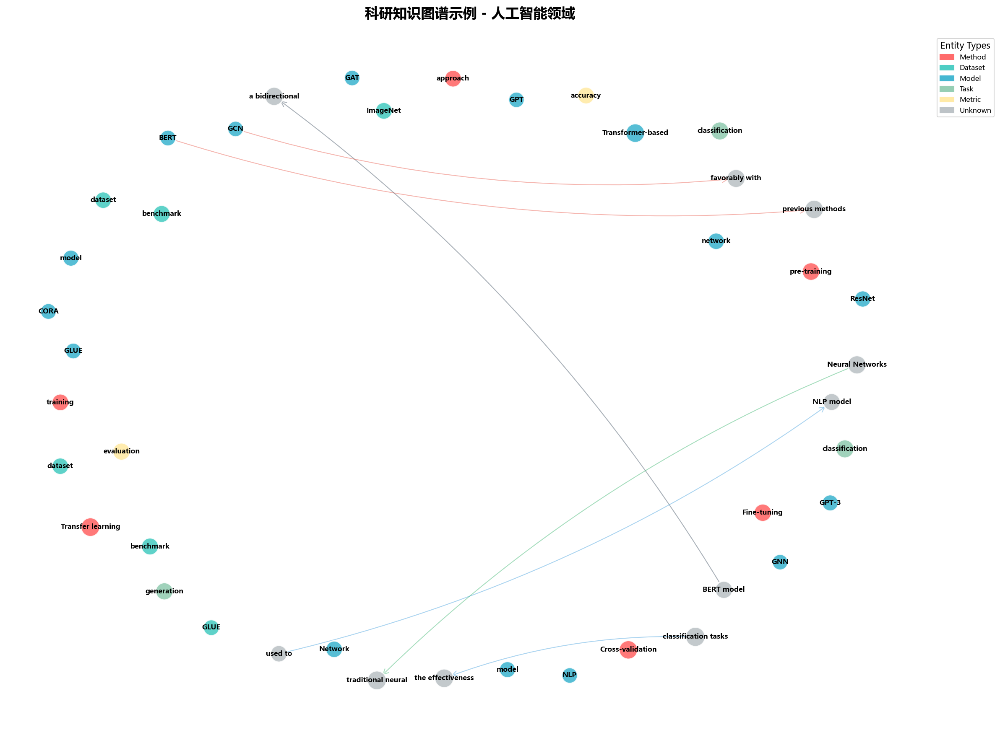
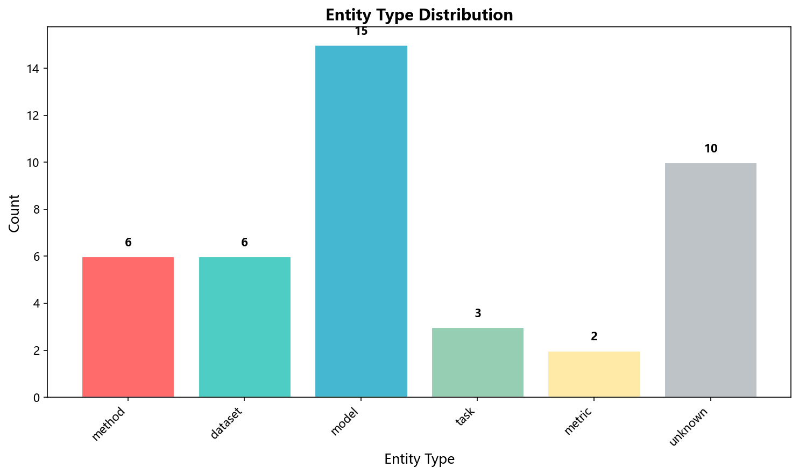
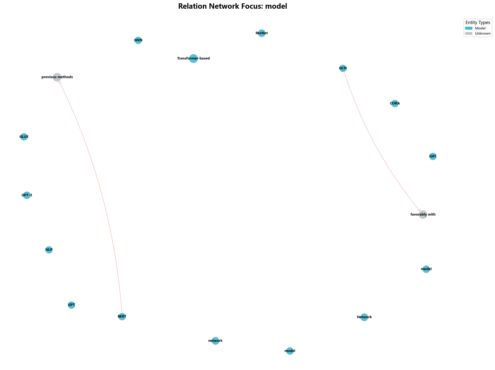
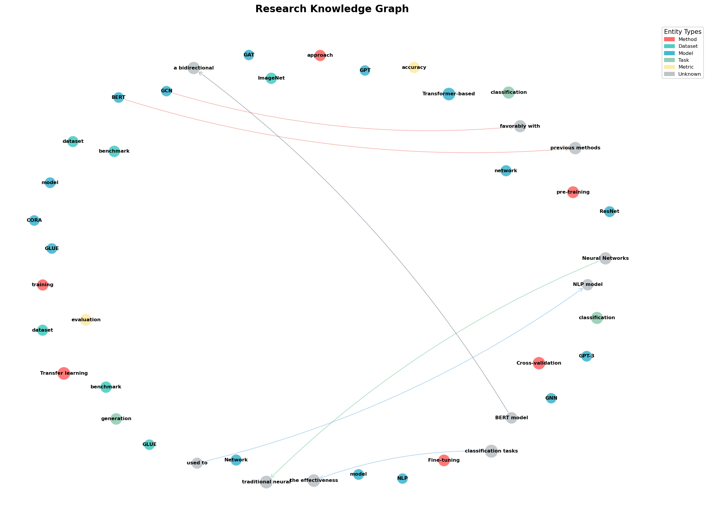

# research-knowledge-graph

> 从科研文献中自动构建领域知识图谱 —— 实体抽取 · 关系识别 · 图谱构建 · 交互可视化 · 研究脉络分析

[](https://github.com/XJH10247/research-knowledge-graph/actions/workflows/ci.yml)
[](https://www.python.org/)
[](LICENSE)
[](https://github.com/astral-sh/ruff)
[](tests/)

**简体中文** | [English](#english)

---

## 目录

- [项目简介](#项目简介)
- [效果预览](#效果预览)
- [功能特性](#功能特性)
- [项目结构](#项目结构)
- [环境要求](#环境要求)
- [安装](#安装)
- [作为 AI Skill 使用](#作为-ai-skill-使用)
- [快速开始](#快速开始)
- [核心用法](#核心用法)
- [模块说明](#模块说明)
- [配置与扩展](#配置与扩展)
- [数据模型](#数据模型)
- [应用场景](#应用场景)
- [常见问题](#常见问题)
- [开发与测试](#开发与测试)
- [贡献](#贡献)
- [许可证](#许可证)
- [引用](#引用)

---

## 项目简介

`research-knowledge-graph` 是一个面向科研场景的知识图谱自动构建工具包。它把一堆散乱的论文摘要、
章节或全文，转化成一张**可查询、可交互、可分析**的实体关系网络。

给定输入文本，它会自动完成：

```
文献文本  ──▶  实体抽取  ──▶  关系识别  ──▶  图谱构建  ──▶  可视化 + 研究脉络分析
                 │              │              │              │
            方法/模型/       uses/extends/   NetworkX      HTML 交互图
            数据集/任务...   proposes...     DiGraph       PNG 静态图
                                                          趋势 / 空白 / 演进
```

它既可以作为 Python 库嵌入你的分析流程，也可以作为 **AI Skill** 被 Agent 直接调用
（仓库根目录的 [`SKILL.md`](SKILL.md) 即为 Skill 入口描述）。

**设计取向**：规则优先、模型可选。核心抽取基于精心编写的中英文正则模式与关键词库，
在没有任何预训练模型的环境下也能开箱即用；若安装了 spaCy 模型，则自动叠加模型抽取以提升召回。

## 效果预览

用 `examples/demo.py` 处理三小段文献摘要后生成的图谱：



| 实体类型分布 | 模型关系网络 |
|---|---|
|  |  |

交互式版本（可缩放 / 拖拽 / 悬停查看实体属性），下图为其截图：



可直接在浏览器打开的示例产物（自包含，无需联网）：
[`docs/demo/knowledge-graph.html`](docs/demo/knowledge-graph.html) ·
[`docs/demo/research-timeline.html`](docs/demo/research-timeline.html)

> 想直接体验：克隆仓库后用浏览器打开上面两个 HTML 文件即可，无需安装任何依赖。
>
> 介绍幻灯片见 [`docs/KG_Skill_Intro_CN.pptx`](docs/KG_Skill_Intro_CN.pptx)。

## 功能特性

### 🔍 实体抽取（EntityExtractor）

- **12 类科学实体**：`method`、`dataset`、`model`、`task`、`metric`、`material`、
  `tool`、`theory`、`measurement`、`software`、`author`、`institution`
- **多策略融合**：spaCy 模型 + 正则模式 + 关键词 + 缩略语 + 姓名 / 作者 / 机构识别
- **中英文双语**：中文按字符子串匹配（绕开 `\b` 词边界不适用的问题），英文按词边界匹配
- **置信度分级**：每种策略对应不同置信度，可用 `min_confidence` 过滤
- **智能去重**：按「文本 + 类型」合并，保留最高置信度的一条
- **可扩展词表**：运行时注册自定义实体类型与模式

### 🔗 关系抽取（RelationExtractor）

- **14 种内置关系**：`uses`、`compares`、`evaluates`、`extends`、`proposes`、`combines`、
  `replaces`、`enables`、`improves`、`achieves`、`introduces`、`develops`、`trains`、`tests`
- **三重抽取路径**：正则模式匹配 → 依存句法分析（spaCy）→ 语法结构启发式
- **实体自动补全**：模式捕获到未登记实体时自动建节点，避免关系悬空
- **同义关系归一**：`enables` / `improves` / `extends` 等近义模式做统一归类

### 🕸️ 图谱构建（GraphBuilder）

- 基于 NetworkX `DiGraph` 的有向图，节点与边均带完整属性
- **多格式导入导出**：JSON、GraphML、GEXF
- **分析能力**：度中心性 / 介数中心性 / PageRank、邻居查询（支持 `depth`）、实体关联关系提取
- **图操作**：按实体 ID / 实体类型 / 关系类型筛选子图，多来源图谱合并
- **结构校验**：`validate_graph()` 返回 `valid` / `errors` / `warnings`

### 🎨 可视化（GraphVisualizer）

- **交互式 HTML**（PyVis）：缩放、拖拽、悬停查看属性，节点大小映射重要度
- **静态 PNG**（Matplotlib）：高 DPI 输出，适合论文与报告
- **时间线图谱**：按年份展示研究演进
- **实体分布图**：实体类型分布柱状图
- **关系网络图**：聚焦某一实体类型的关系子网
- **子图聚焦**与**图谱摘要**视图
- **中文字体自动适配**：内置 Windows / macOS / Linux 常见中文字体回退链，避免方块乱码

### 📈 研究脉络分析（TrajectoryAnalyzer）

- **研究演进路径**：追踪方法 / 模型随时间的发展链条
- **趋势检测**：识别增长最快的研究方向（含增长率与当前热度）
- **研究空白发现**：基于共同邻居挖掘尚未建立的潜在关联
- **研究摘要**：一键生成领域概况、关键发现与改进建议
- **影响力分析**：按入度 / 出度加权评估单个实体的影响力
- **关键贡献者识别**：综合 PageRank、介数中心性、紧密度中心性排序

### ⚙️ 工程化

- 统一入口 `KnowledgeGraphPipeline`，覆盖「抽取 → 构建 → 可视化 → 分析」全流程
- **优雅降级**：缺少 spaCy 时回退纯规则抽取；缺少 matplotlib / pyvis 时可视化按需加载，不影响抽取
- **零强制依赖负担**：核心仅依赖 `networkx`，可视化与 NLP 通过 extras 按需安装
- 27 个单元测试覆盖五大模块、Pipeline 与可视化回归场景，GitHub Actions 在 Python 3.9 ~ 3.13 上跨平台复跑

## 项目结构

```
research-knowledge-graph/
├── research_kg/                       # 可导入的 Python 包（唯一发布产物）
│   ├── __init__.py                    # KnowledgeGraphPipeline 与顶层导出
│   └── modules/
│       ├── __init__.py
│       ├── entity_extractor.py        # 实体抽取
│       ├── relation_extractor.py      # 关系抽取
│       ├── graph_builder.py           # 图谱构建
│       ├── visualizer.py              # 可视化
│       └── trajectory_analyzer.py     # 研究脉络分析
├── examples/
│   └── demo.py                        # 三种模式的完整示例
├── tests/
│   └── test_knowledge_graph.py        # 单元测试
├── docs/
│   ├── KG_Skill_Intro_CN.pptx         # 项目介绍幻灯片
│   ├── images/                        # README 引用的静态示例图
│   └── demo/                          # 可直接打开的交互式 HTML 示例
├── references/
│   └── api.md                         # Skill 渐进披露：详细 API 契约
├── locales/
│   ├── zh-CN.json                     # 桌面插件展示名（中文）
│   └── en-US.json                     # 桌面展示名（英文）
├── .github/
│   ├── workflows/ci.yml               # CI：测试矩阵 + lint
│   ├── ISSUE_TEMPLATE/                # Issue 模板
│   └── pull_request_template.md
├── SKILL.md                           # Skill 入口（供 AI Agent 读取）
├── README.md                          # 本文件（面向使用者）
├── CHANGELOG.md                       # 更新日志
├── CONTRIBUTING.md                    # 贡献指南
├── CODE_OF_CONDUCT.md                 # 行为准则
├── SECURITY.md                        # 安全漏洞报告渠道
├── CITATION.cff                       # 引用信息
├── LICENSE                            # MIT
├── pyproject.toml                     # 打包与工具链配置
├── requirements.txt                   # 核心依赖
├── requirements-dev.txt               # 开发依赖
└── .editorconfig / .gitignore
```

每个目录的职责边界、新增文件时应放的位置，见 [CONTRIBUTING.md](CONTRIBUTING.md#项目结构约定)。

## 环境要求

- **Python** 3.9 或更高（CI 覆盖 3.9 / 3.10 / 3.11 / 3.12 / 3.13）
- **内存** 建议 4 GB 以上（仅在加载 spaCy 模型时需要）
- **操作系统** 跨平台，Windows / macOS / Linux 均可

## 安装

### 从源码安装

```bash
git clone https://github.com/XJH10247/research-knowledge-graph.git
cd research-knowledge-graph

# 方式一：只装核心 + 可视化依赖（推荐新手）
pip install -r requirements.txt

# 方式二：以可编辑模式安装，装齐全部能力
pip install -e ".[all]"

# 方式三：同时装开发工具（pytest / ruff）
pip install -e ".[all,dev]"
```

### 可选：启用 spaCy 以获得更高召回

不安装也能正常跑，`EntityExtractor` 会自动回退到纯规则抽取，只是召回率略低。

```bash
pip install "research-knowledge-graph[nlp]"    # 或在源码目录：pip install -e ".[nlp]"

python -m spacy download en_core_web_sm        # 英文文献
python -m spacy download zh_core_web_sm        # 中文文献
```

> 两个模型都装上时，`EntityExtractor` 会优先用 `model_name` 指定的模型，
> 加载失败则自动尝试另一种语言，最后回退到规则抽取。

## 作为 AI Skill 使用

本仓库同时是 **AI Agent Skill**：根目录的 [`SKILL.md`](SKILL.md) 是标准 Skill 入口
（YAML frontmatter + 指令正文），[`references/api.md`](references/api.md) 提供完整 API 契约，
`locales/` 提供多语言展示名（部分桌面端会读取）。任何能加载 `SKILL.md` 的 Agent
（Claude Code、Cursor、OpenCode、MiMo Desktop / MiMoCode 等）都可直接使用。

### 通用安装步骤

```bash
# 1. 克隆仓库
git clone https://github.com/XJH10247/research-knowledge-graph.git
cd research-knowledge-graph

# 2. 安装 Python 包，保证运行环境可 import
pip install -e ".[all]"    # 核心 + 可视化 + NLP

# 3. 把 Skill 装进当前 Agent 的 skills 目录
#    目录名 = skill ID，须等于 SKILL.md 里的 name（research-knowledge-graph）
SKILL_ID=research-knowledge-graph
mkdir -p "<your-agent-skills-dir>/$SKILL_ID"
cp -r SKILL.md references locales "<your-agent-skills-dir>/$SKILL_ID/"
```

第 3 步中的 `<your-agent-skills-dir>` 换成你所用 Agent 的 skill 路径即可。常见示例：

| Agent / 环境 | 典型 skills 目录 |
|---|---|
| Claude Code（项目级） | `<project>/.claude/skills/` |
| Claude Code（用户级） | `~/.claude/skills/` |
| MiMo Desktop / MiMoCode（全局） | `~/.config/mimocode/skills/` |
| MiMo Desktop / MiMoCode（项目级） | `<project>/.mimocode/skills/` |
| OpenCode 等 | 参见该工具文档中的 skills / instructions 目录 |
| 通用约定 | 任意含 `SKILL.md` 的文件夹，挂到 Agent 的 skill 扫描路径 |

Windows 路径示例（MiMoCode 全局）：

```powershell
pip install -e ".[all]"
$skillDir = Join-Path $env:USERPROFILE ".config\mimocode\skills\research-knowledge-graph"
New-Item -ItemType Directory -Force -Path $skillDir | Out-Null
Copy-Item SKILL.md, references, locales -Destination $skillDir -Recurse -Force
```

### 纯 Skill 目录应包含什么

安装到 skills 目录时，只复制：

- `SKILL.md`（必需，文件名须完全一致）
- `references/`（详细 API，按需加载）
- `locales/`（可选，展示名）
- 已通过 `pip` 安装的 `research_kg` 包（或设置 `PYTHONPATH` 指向本仓库）

**不要**把整个 GitHub 仓库原样当作 skill 目录：纯 skill 安装不应包含 `README.md`、
`.github/`、`tests/`、`docs/` 等仓库专用文件。本仓库是「库 + Skill」双形态，
根目录保留 `README.md` 是为了 GitHub 与文档规范；复制 skill 时按上表精简即可。

若未把包装进 site-packages，请保证 Agent 运行目录能 `import research_kg`
（在仓库内运行，或设置 `PYTHONPATH` 指向克隆目录）。

### 触发与验证

安装后**新开会话**，Agent 通常能通过下列说法加载本 Skill：

- 中文：知识图谱、文献综述、实体抽取、关系识别、研究趋势、科研文献分析
- 英文：knowledge graph、entity extraction、relation extraction、literature review

快速自检：

```bash
# 包可导入
python -c "from research_kg import KnowledgeGraphPipeline; print('ok')"

# Skill 文件在位
ls <your-agent-skills-dir>/research-knowledge-graph/SKILL.md
```

在对话中直接说「用 knowledge-graph skill 从下面几段摘要建图」，或按你的 Agent
约定显式触发（如 `/research-knowledge-graph`）。详细规格见 [`SKILL.md`](SKILL.md)。

### 作为 Python 库被 Skill / 脚本调用

```bash
pip install -e ".[all]"
```

```python
from research_kg import KnowledgeGraphPipeline
```

Skill 与库共享同一包 `research_kg`，无额外适配层；Agent 按 `SKILL.md` 中的流程调用即可。

## 快速开始

```python
from research_kg import KnowledgeGraphPipeline

# 1. 初始化（lazy_visualizer=True 时，可视化组件延迟到首次使用才加载）
pipeline = KnowledgeGraphPipeline()

# 2. 输入文献文本，中英文可混用
documents = [
    "Transformer-based models have revolutionized natural language processing. "
    "The BERT model uses a bidirectional attention mechanism for pre-training.",

    "GCN aggregates neighbor information for node classification tasks. "
    "The CORA dataset is a benchmark for citation network analysis.",

    # 中文同样支持：
    # "基于Transformer的模型革新了自然语言处理领域。",
    # "BERT使用双向注意力机制进行预训练。",
]

# 3. 一键完成 实体抽取 + 关系抽取 + 图谱构建
entities, relations, graph = pipeline.process_documents(documents)

print(f"抽取到 {len(entities)} 个实体、{len(relations)} 条关系、"
      f"{graph.number_of_nodes()} 个节点 / {graph.number_of_edges()} 条边")

# 4. 可视化
pipeline.visualize(graph, 'knowledge_graph.html', mode='interactive')
pipeline.visualize(graph, 'knowledge_graph.png',  mode='static')
pipeline.visualizer.visualize_entity_distribution(graph, 'entity_distribution.png')

# 5. 研究脉络分析
analysis = pipeline.analyze(graph)
for trend in analysis['trends'][:5]:
    print(f"趋势：{trend['name']}  增长率 {trend['growth_rate']:.2f}")
for gap in analysis['gaps'][:5]:
    print(f"研究空白：{gap['source_entity']} ⋯ {gap['target_entity']}（{gap['gap_type']}）")
```

> **提示**：`trends` / `gaps` / `evolutions` 的质量取决于图谱规模与连通度。
> 上面这段玩具输入只有约 60 个节点、密度 0.003，趋势与空白很可能为空——
> 这是正常现象。请用数十篇以上同领域文献，并尽量提供带 `year` 的 `publications`
> 元数据（`analyze_evolution` / `analyze_temporal_evolution` 依赖年份）。

### 运行内置示例

```bash
python examples/demo.py
```

示例提供三种模式：

| 模式 | 内容 |
|---|---|
| 1. Basic Demo | 实体 / 关系抽取 + 三种可视化 |
| 2. Advanced Features Demo | 自定义实体与关系类型、图谱校验、子图可视化 |
| 3. Full Pipeline | 完整五阶段流程 + 图谱摘要图 |
| 4. All Demos | 依次运行以上全部 |

产物写入 `examples/output/`（已在 `.gitignore` 中忽略）。

### 端到端一行式流程

```python
from research_kg import KnowledgeGraphPipeline
import json

pipeline = KnowledgeGraphPipeline()

publications = [
    {'id': 1, 'title': 'Attention is All You Need', 'year': 2017, 'entities': ['Transformer', 'attention']},
    {'id': 2, 'title': 'BERT: Pre-training of Deep Bidirectional Transformers', 'year': 2018,
     'entities': ['BERT', 'attention', 'pre-training']},
]

result = pipeline.run_full_pipeline(
    documents=[p['title'] for p in publications],
    publications=publications,
    output_dir='./output',
)

# 导出图谱供下游使用
pipeline.graph_builder.save_to_file('./output/graph.json', 'json')
pipeline.graph_builder.save_to_file('./output/graph.graphml', 'graphml')
```

## 核心用法

### 实体抽取

```python
from research_kg.modules.entity_extractor import EntityExtractor

extractor = EntityExtractor()                       # 默认英文模型，可选 "zh_core_web_sm"

# 全类型抽取，置信度阈值 0.6
entities = extractor.extract_entities(text, min_confidence=0.6)

# 只抽特定类型
entities = extractor.extract_entities(
    text, entity_types=['method', 'model', 'dataset'], min_confidence=0.5
)

# 批量处理（返回 List[List[Entity]]，并自动回填 source_document 为 doc_0 / doc_1 ...）
batches = extractor.extract_from_documents(documents)

# 统计与词表
stats = extractor.get_entity_statistics(entities)
# {'total_entities': 42, 'by_type': {...}, 'avg_confidence': 0.68, 'high_confidence_count': 5}
vocab = extractor.build_entity_vocabulary(entities)
# {'model': ['BERT', 'GCN'], 'dataset': ['CORA'], ...}
```

### 关系抽取

```python
from research_kg.modules.relation_extractor import RelationExtractor

extractor = RelationExtractor()
relations = extractor.extract_relations(text, entities, min_confidence=0.5)

for r in relations:
    print(r.source_entity_id, '--[', r.relation_type, ']-->', r.target_entity_id,
          f'({r.confidence:.2f})')

stats = extractor.get_relation_statistics(relations)
```

### 图谱操作

```python
from research_kg.modules.graph_builder import GraphBuilder

builder = GraphBuilder()
graph = builder.build_graph(entities, relations)

# 统计与校验（空图时 get_graph_statistics() 返回 {'status': 'empty'}）
stats = builder.get_graph_statistics()
# {'num_nodes', 'num_edges', 'density', 'connected_components', 'entity_types', ...}
report = builder.validate_graph()
# {'valid': True, 'errors': [], 'warnings': []}

# 中心性分析
top = builder.find_central_entities(top_k=10, method='degree')   # 亦支持 'betweenness' / 'pagerank'

# 邻居探查
neighbors = builder.find_entity_neighbors(entity_id, depth=2)
relations_of = builder.get_entity_relations(entity_id)

# 子图筛选：按 ID / 实体类型 / 关系类型三重条件
sub = builder.filter_subgraph(entity_types=['model', 'dataset'],
                             relation_types=['uses', 'evaluates'])

# 导入导出
builder.save_to_file('graph.json', 'json')          # 亦支持 'graphml' / 'gexf'
loaded = GraphBuilder().load_from_file('graph.json', 'json')
```

### 可视化

```python
from research_kg.modules.visualizer import GraphVisualizer

viz = GraphVisualizer(figsize=(16, 12), dpi=150)

# 交互式 HTML（默认自包含，可离线打开、可直接拷贝分发）
viz.visualize_interactive(graph, 'knowledge_graph.html')

# 若希望 HTML 体积最小、可接受联网加载，改为引用 CDN：
viz.visualize_interactive(graph, 'knowledge_graph.html', cdn_resources='remote')

# 时间线：publications 的 entities 既可写节点 ID，也可直接写实体文本
viz.visualize_timeline(graph, publications, 'timeline.html')

# 静态图与统计图
viz.visualize_static(graph, 'graph.png', title='我的知识图谱', layout_type='spring')
viz.visualize_entity_distribution(graph, 'entity_distribution.png')
viz.visualize_relation_network(graph, entity_type='model', output_path='models.png')
viz.visualize_subgraph(graph, node_ids=[e.entity_id for e in entities[:5]], output_path='sub.png')
viz.visualize_graph_summary(graph, 'graph_summary.png')
```

`cdn_resources` 三档可选：

| 取值 | 表现 | 适用场景 |
|---|---|---|
| `'in_line'`（默认） | JS/CSS 全部内联进 HTML（约 700 KB） | 需要离线打开、归档或随论文附件分发 |
| `'remote'` | 引用 CDN，文件最小 | 确定读者有网络，且在意仓库体积 |
| `'local'` | 把 vis-network 资源复制到工作目录的 `lib/` | 需要离线且不想增大 HTML 体积；**移动 HTML 后相对引用会失效** |

### 研究脉络分析

```python
from research_kg.modules.trajectory_analyzer import TrajectoryAnalyzer

analyzer = TrajectoryAnalyzer(graph)        # 也可先构造再赋 analyzer.graph = graph

analyzer.detect_trends(time_window=5, entity_types=['method', 'model'], max_results=15)
analyzer.find_research_gaps(max_results=20, min_common_neighbors=1)
analyzer.analyze_evolution(publications, max_methods=20, max_results=10)
analyzer.analyze_temporal_evolution(publications)
analyzer.generate_research_summary()        # {'graph_statistics', 'key_findings', 'suggestions'}

analyzer.analyze_impact_strength(entity_id) # {'impact_score', 'in_degree', 'out_degree', ...}
analyzer.identify_key_contributors(top_k=10)
```

### Pipeline 快捷方法

| 方法 | 说明 |
|---|---|
| `process_documents(documents, entity_types=None, min_confidence=0.5)` | 抽取 + 建图，返回 `(entities, relations, graph)` |
| `visualize(graph, output_path, mode='interactive')` | `mode` 取 `'interactive'`（HTML）或 `'static'`（PNG） |
| `analyze(graph, publications=None)` | 返回 `summary` / `trends` / `gaps` / `evolutions` |
| `run_full_pipeline(documents, publications=None, output_dir='./output')` | 五阶段全流程 |
| `get_graph_validation(graph)` | 图谱结构校验 |
| `get_entity_relations(graph, entity_id)` | 单个实体的全部关联关系 |
| `analyze_impact(graph, entity_id)` | 实体影响力分析 |
| `identify_contributors(graph, top_k=10)` | 关键贡献实体排序 |

## 模块说明

| 模块 | 类 | 主要职责 |
|---|---|---|
| `entity_extractor` | `EntityExtractor` / `Entity` / `EntityType` | 12 类实体抽取、去重、统计、词表 |
| `relation_extractor` | `RelationExtractor` / `Relation` / `RelationType` | 14 类关系抽取、自定义模式 |
| `graph_builder` | `GraphBuilder` | 建图、导入导出、子图、中心性、校验 |
| `visualizer` | `GraphVisualizer` | 交互 / 静态 / 时间线 / 分布 / 网络 / 子图 / 摘要 |
| `trajectory_analyzer` | `TrajectoryAnalyzer` / `Trend` / `ResearchGap` / `EvolutionPath` / `ImpactAnalysis` | 趋势、空白、演进、影响力 |

`GraphVisualizer` 依赖 `matplotlib` / `pyvis`，未被 `research_kg` 顶层导入；
`research_kg.modules.GraphVisualizer` 采用惰性属性访问，因此缺少可视化依赖时抽取与分析流程不受影响。

## 配置与扩展

### 自定义实体类型

```python
from research_kg.modules.entity_extractor import EntityExtractor

extractor = EntityExtractor()

# 推荐：一次性注册关键词 + 正则模式
extractor.add_custom_entity_type(
    'domain',
    {'machine learning', 'computer vision', 'reinforcement learning'},
    [r'\b(machine learning|computer vision|reinforcement learning)\b'],
)

# 也可以直接扩展现有词表
extractor.entity_keywords['method'].add('知识蒸馏')
```

### 自定义关系类型

```python
from research_kg.modules.relation_extractor import RelationExtractor

extractor = RelationExtractor()
# 模式需包含两个捕获组：第 1 组为源实体、第 2 组为目标实体
extractor.add_custom_relation_type('develops', [
    r'\b(\w+(?:\s+\w+)?)\s+develops?\s+(\w+(?:\s+\w+)?)',
])
```

### 自定义可视化样式

```python
from research_kg.modules.visualizer import GraphVisualizer

viz = GraphVisualizer(figsize=(20, 15), dpi=200)
viz.set_custom_colors(
    entity_colors={'model': '#FF6B6B', 'dataset': '#4ECDC4'},
    relation_colors={'uses': '#2C3E50'},
)
viz.set_custom_layout('kamada_kawai')     # spring / circular / shell / kamada_kawai
viz.visualize_static(graph, 'graph.png', title='我的知识图谱', layout_type='spring')
```

### 置信度阈值参考

| 抽取策略 | 默认置信度 | 说明 |
|---|---|---|
| spaCy 模型 | 0.80 | 需安装模型；`PERSON`→author，`ORG`→institution，`PRODUCT`→tool |
| spaCy 时间 / 数量 | 0.64 | `DATE` / `PERCENT` / `CARDINAL` 等映射为 `measurement` |
| 姓名识别 | 0.75 | 需同时命中 model / method / algorithm / approach 等词 |
| 作者引用格式 | 0.70 | 形如 `Devlin, J.` |
| 正则模式 | 0.70 | 中英文双语模式表 |
| 缩略语识别 | 0.65 | 全大写 2 ~ 6 字符，按上下文归类 |
| 关键词匹配 | 0.60 | 中英文双语关键词表 |
| 缩略语（无上下文） | 0.45 | 无上下文线索时默认归为 `model` |
| 名词短语 | 0.50 | 形如 `X is/are/uses ...` 的句法模板 |
| 自定义类型 | 0.55 | 通过 `add_custom_entity_type` 注册 |

关系抽取的置信度：正则模式 0.70、语法结构 0.65、依存句法 0.60、
上下文推断 0.55、自动补全实体 0.30。

## 数据模型

```python
@dataclass
class Entity:
    entity_id: str          # 唯一标识（uuid4）
    text: str               # 实体原文
    type: str               # 实体类型
    start_pos: int          # 原文起始位置
    end_pos: int            # 原文结束位置
    confidence: float       # 抽取置信度
    source_document: str    # 来源文档（如 doc_0）
    synonyms: List[str]     # 同义词
    attributes: Dict        # 扩展属性（含抽取来源）

@dataclass
class Relation:
    entity_id: str          # 关系唯一标识
    source_entity_id: str   # 源实体 ID
    target_entity_id: str   # 目标实体 ID
    relation_type: str      # 关系类型
    confidence: float       # 抽取置信度
    context: str            # 命中的上下文片段
    source_document: str    # 来源文档
    attributes: Dict        # 扩展属性

@dataclass
class Trend:
    name: str; growth_rate: float; current_momentum: float
    key_entities: List[str]; time_range: Tuple[int, int]; description: str

@dataclass
class ResearchGap:
    source_entity: str; target_entity: str; gap_type: str
    potential: float; related_entities: List[str]; description: str

@dataclass
class EvolutionPath:
    path: List[str]; confidence: float; time_span: Tuple[int, int]
    key_methods: List[str]; summary: str

@dataclass
class ImpactAnalysis:
    entity_id: str; entity_text: str; impact_score: float
    influence_sources: List[str]; influenced_targets: List[str]
    total_connections: int; description: str
```

所有数据类均提供 `to_dict()`；`Entity` 与 `Relation` 额外提供 `from_dict()` 用于反序列化。

## 应用场景

| 场景 | 用法 |
|---|---|
| **文献综述辅助** | 批量导入摘要，快速锁定核心方法、数据集、任务与演进脉络 |
| **研究趋势识别** | `detect_trends()` 找出增长最快的研究方向 |
| **研究选题参考** | `find_research_gaps()` 挖掘尚未建立的潜在概念关联 |
| **团队知识库** | 汇总团队历年论文，可视化研究方向布局与技术优势 |
| **学术写作支持** | 定位可用数据集与评价指标，追溯方法之间的继承关系 |
| **课程与教学** | 用交互式图谱直观展示一个领域的知识结构 |

## 常见问题

<details>
<summary><b>不装 spaCy 能用吗？</b></summary>

可以。`EntityExtractor` 会捕获 `ImportError` / `OSError` 并回退到纯规则抽取
（正则 + 关键词 + 缩略语），`logger.warning` 会提示回退信息。关系抽取同样会跳过依存句法路径。
</details>

<details>
<summary><b>不出图，报 matplotlib 相关错误？</b></summary>

可视化依赖是可选的。`KnowledgeGraphPipeline(lazy_visualizer=True)`（默认）不会在初始化时导入它。
若确实需要出图，安装 `pip install "research-knowledge-graph[viz]"`；
在无显示环境（服务器 / Docker / CI）下请设置 `MPLBACKEND=Agg`。
</details>

<details>
<summary><b>中文图谱显示成方块？</b></summary>

`_setup_chinese_font()` 会依序尝试 Microsoft YaHei、SimHei、SimSun、KaiTi、FangSong、
Arial Unicode MS、PingFang SC、Noto Sans CJK SC、WenQuanYi Micro Hei。
若全部缺失，请在系统安装任一中文字体，或手动指定：

```python
import matplotlib.pyplot as plt
plt.rcParams['font.sans-serif'] = ['你的中文字体名']
plt.rcParams['axes.unicode_minus'] = False
```
</details>

<details>
<summary><b>抽取结果太多或太少？</b></summary>

先调 `min_confidence`。规则路径噪声偏多时提高阈值（如 0.7）；
若希望提高召回，安装 spaCy 模型并降低阈值。也可用 `entity_types` 只保留关心的类型。
</details>

<details>
<summary><b>为什么同一条关系出现了多次？</b></summary>

多重抽取路径（正则 / 句法 / 语法）可能命中同一对实体。`_deduplicate_relations()`
会按「源实体 + 目标实体 + 关系类型」合并并保留最高置信度，无需手动处理。
</details>

<details>
<summary><b>运行交互式可视化后，项目根目录多出一个 <code>lib/</code> 文件夹？</b></summary>

这是 PyVis 在 `cdn_resources='local'` 模式下的固有行为——它会把 vis-network 的静态资源
复制到当前工作目录。本项目的默认值是 `cdn_resources='in_line'`（全部内联进 HTML），
因此**不会**产生该目录。

如果你显式传了 `'local'`，或直接用 PyVis 生成了文件，可以安全删除 `lib/`；
该目录已被 `.gitignore` 兜底忽略。若希望 HTML 能脱离 `lib/` 独立分发，请改用默认的 `'in_line'`。
</details>

<details>
<summary><b>时间线图谱里论文和实体没有连起来？</b></summary>

`visualize_timeline` 会用 `publications[i]['entities']` 去图谱里找节点：

1. 先按节点 ID 精确匹配；
2. 匹配不到则按**实体文本**（忽略大小写、去除首尾空白）回退匹配；
3. 仍匹配不到就跳过该条引用（不会报错，仅记录日志）。

所以请确保 `entities` 里写的是图谱中的实体 ID 或实体文本。若用了完全不同的名字，
它们不会被连边——这是预期行为，避免在图上凭空造出不存在的节点。
</details>

<details>
<summary><b>旧代码里的 <code>from src import ...</code> 报错了？</b></summary>

1.0.0 首次公开发布前，包目录已由 `src/` 重命名为 `research_kg/`，请同步替换导入路径。
详见 [CHANGELOG.md](CHANGELOG.md)。
</details>

## 开发与测试

```bash
# 安装开发依赖
pip install -e ".[all,dev]"

# 运行全部测试（27 个用例）
pytest -q

# 覆盖率
pytest -q --cov=research_kg --cov-report=term-missing

# 代码规范
ruff check .
ruff check . --fix
```

无显示环境下运行测试需设置 `MPLBACKEND=Agg`。

CI 配置见 [`.github/workflows/ci.yml`](.github/workflows/ci.yml)：
在 Python 3.9 ~ 3.13 上跑测试矩阵，额外在 Windows + Python 3.12 复跑一次，并执行 `ruff check`。

## 贡献

欢迎提交 Issue 与 Pull Request！开始之前请阅读 [CONTRIBUTING.md](CONTRIBUTING.md) 与
[CODE_OF_CONDUCT.md](CODE_OF_CONDUCT.md)，其中包含：

- 开发环境搭建与项目结构约定
- 代码规范、测试要求
- [Conventional Commits](https://www.conventionalcommits.org/zh-hans/) 提交信息规范
- 如何扩展实体类型、关系类型与可视化视图

简要流程：

```bash
git checkout -b feat/your-feature
# ... 修改代码并补充测试 ...
pytest -q && ruff check .
git commit -m "feat(entity): 支持从标题行抽取机构实体"
```

提交 PR 时请说明改动目的、实现方式、验证方式与是否破坏兼容性。
安全漏洞请按 [SECURITY.md](SECURITY.md) 私密报告，勿在公开 Issue 中披露。

## 许可证

本项目基于 [MIT License](LICENSE) 发布，© 2026 XJH10247。

你可以自由使用、修改、分发本项目，包括商业用途，只需保留原始版权声明与许可文本。

## 引用

如果你的研究工作用到了本项目，欢迎引用：

```bibtex
@software{research_kg_2026,
  title        = {research-knowledge-graph: 科研文献知识图谱自动构建工具},
  author       = {XJH10247},
  year         = {2026},
  version      = {1.0.0},
  license      = {MIT},
  url          = {https://github.com/XJH10247/research-knowledge-graph}
}
```

仓库根目录提供了符合 [Citation File Format](https://citation-file-format.github.io/) 的
[`CITATION.cff`](CITATION.cff)，GitHub 会自动在侧边栏渲染「Cite this repository」按钮。

---

## English

**research-knowledge-graph** automatically builds domain knowledge graphs from scientific
literature — entity extraction, relation identification, graph construction, interactive
visualization and research-trajectory analysis, with bilingual (Chinese / English) support.

It works both as a **Python library** and as an **AI Skill** ([`SKILL.md`](SKILL.md) +
[`references/api.md`](references/api.md) + `locales/`).

```bash
pip install -e ".[all]"
python examples/demo.py
```

```python
from research_kg import KnowledgeGraphPipeline

pipeline = KnowledgeGraphPipeline()
entities, relations, graph = pipeline.process_documents([
    "BERT uses a bidirectional attention mechanism for pre-training.",
    "GCN aggregates neighbor information for node classification tasks.",
])
pipeline.visualize(graph, 'knowledge_graph.html', mode='interactive')
analysis = pipeline.analyze(graph)
print(analysis['trends'], analysis['gaps'])
```

- **12 entity types**: method, dataset, model, task, metric, material, tool, theory,
  measurement, software, author, institution
- **14 relation types**: uses, compares, evaluates, extends, proposes, combines, replaces,
  enables, improves, achieves, introduces, develops, trains, tests
- **Zero-model operation**: works without spaCy by falling back to rule-based extraction
- **Optional visualization**: `matplotlib` / `pyvis` are lazy-loaded via the `viz` extra

See [CONTRIBUTING.md](CONTRIBUTING.md) for the development workflow,
[`SKILL.md`](SKILL.md) for the AI-Agent skill entry point, and
[SECURITY.md](SECURITY.md) for vulnerability reporting.

Licensed under the [MIT License](LICENSE).
